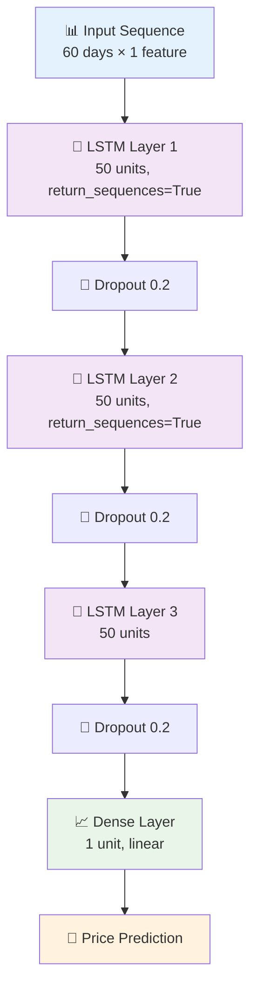
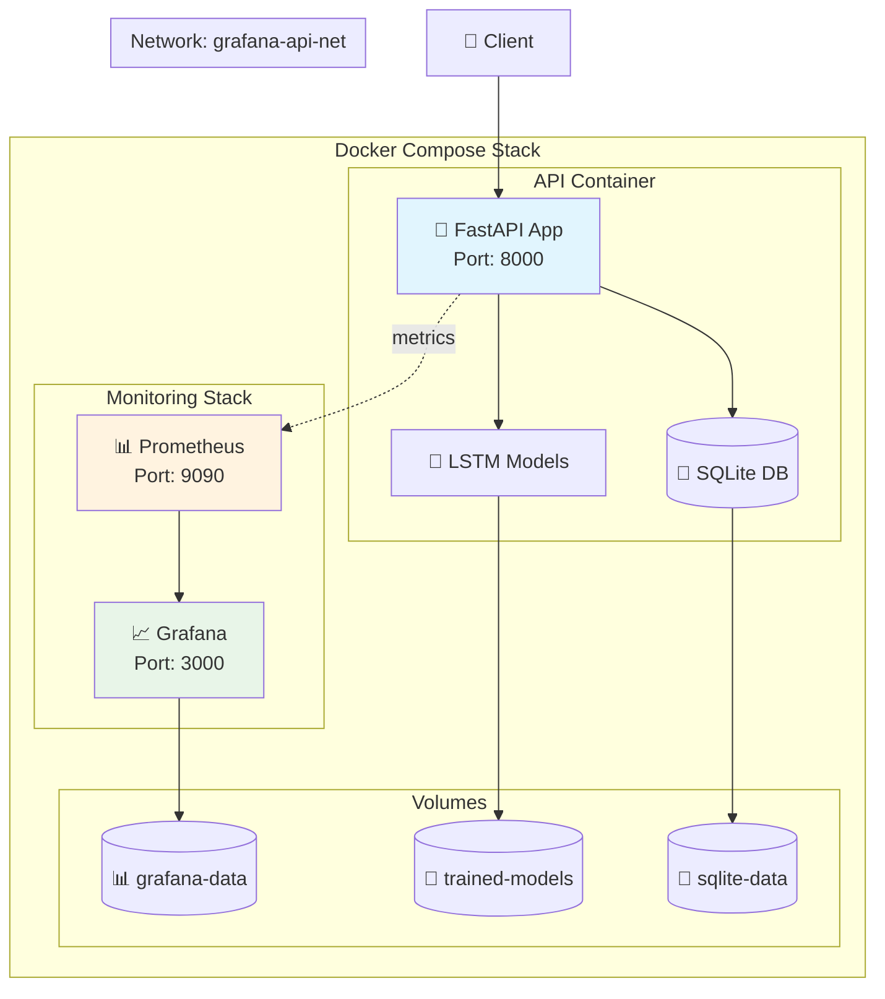
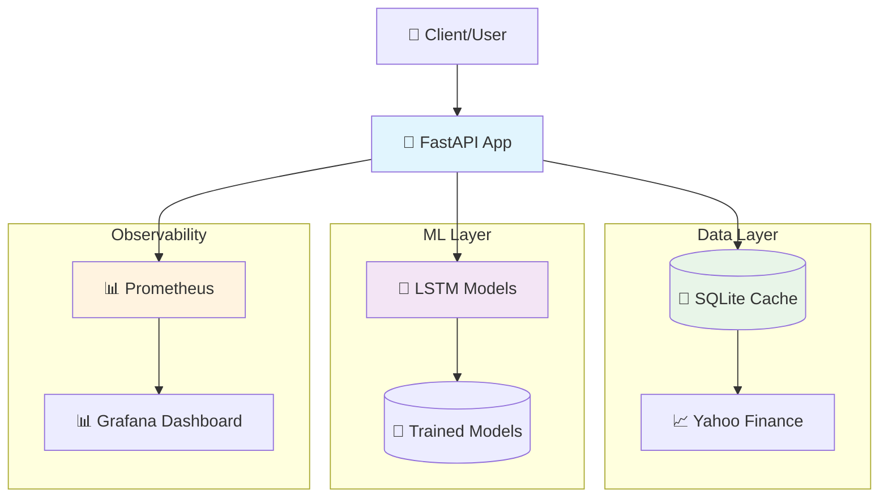
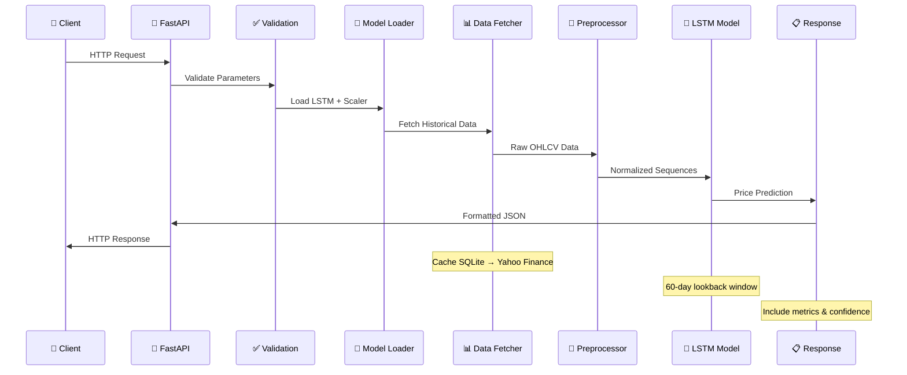
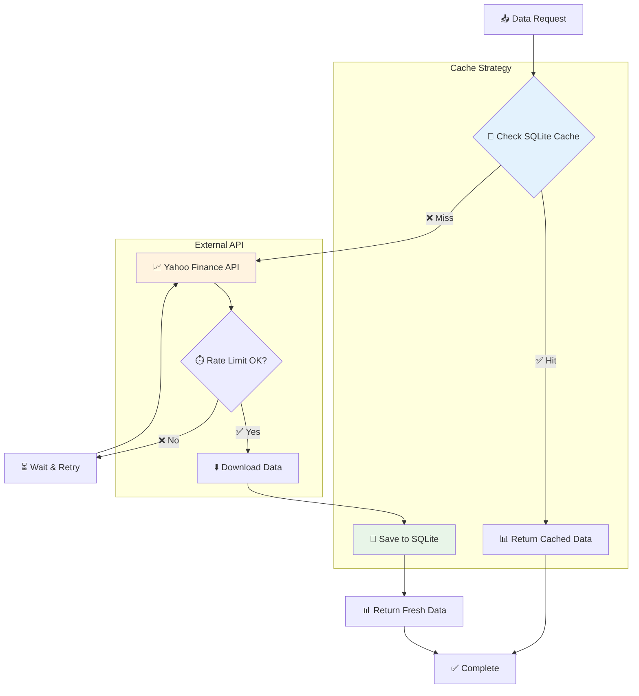

# 🚀 **API de Previsão de Cotações - LSTM**

[](https://python.org)
[](https://fastapi.tiangolo.com)
[](https://tensorflow.org)
[](https://docker.com)
[](LICENSE)

---

## 📋 **Índice**

### 🎯 **Visão Geral e Funcionalidades**

- [Visão Geral](#-visão-geral)
- [O Que o Sistema Faz](#-o-que-o-sistema-faz)
    - [Funcionalidades Core](#funcionalidades-core)
    - [Ativos Suportados](#ativos-suportados)

### 🚀 **Guia de Instalação e Configuração**

- [Instalação](#-instalação)
    - [Pré-requisitos](#pré-requisitos)
    - [Instalação Local](#instalação-local)
    - [Instalação com Docker](#instalação-com-docker)
- [Treinamento dos Modelos](#-treinamento-dos-modelos)
    - [Processo de Treinamento](#processo-de-treinamento)
    - [O Que Acontece Durante o Treinamento](#o-que-acontece-durante-o-treinamento)
    - [Exemplo de Saída do Treinamento](#exemplo-de-saída-do-treinamento)
- [Execução](#-execução)
    - [Execução Local](#execução-local)
    - [Execução com Docker](#execução-com-docker)
    - [Verificação da Saúde](#verificação-da-saúde)

### 🔌 **Documentação da API**

- [Endpoints da API](#-endpoints-da-api)
    - [Documentação Interativa](#-documentação-interativa)
    - [1. Previsão Individual](#1-previsão-individual)
    - [2. Previsão Histórica](#2-previsão-histórica)
    - [3. Métricas Prometheus](#3-métricas-prometheus)
    - [Códigos de Status](#códigos-de-status)

### 🏗️ **Arquitetura e Tecnologia**

- [Arquitetura Técnica](#-arquitetura-técnica)
    - [Visão Geral da Arquitetura](#visão-geral-da-arquitetura)
    - [Componentes Principais](#componentes-principais)
    - [Fluxo de Dados](#fluxo-de-dados)
    - [Estratégia de Cache](#estratégia-de-cache)
- [Observabilidade](#-observabilidade)
    - [Métricas Prometheus](#métricas-prometheus)
    - [Grafana Dashboard](#grafana-dashboard)
    - [Logs Estruturados](#logs-estruturados)
- [Estrutura do Projeto](#-estrutura-do-projeto)

### ⚠️ **Limitações e Responsabilidades**

- [Limitações e Uso Responsável](#-limitações-e-uso-responsável)
    - [Limitações Técnicas](#limitações-técnicas)
    - [Limitações Financeiras](#limitações-financeiras)
    - [Uso Responsável](#-uso-responsável)
    - [Melhorias Futuras](#melhorias-futuras)

### 📄 **Licença e Contribuição**

- [Licença](#-licença)
    - [Isenção de Responsabilidade](#-isenção-de-responsabilidade)
- [Contribuição](#-contribuição)
    - [Áreas de Contribuição](#áreas-de-contribuição)

---

## 🎯 **Visão Geral**

Sistema de previsão de preços de ações da B3 utilizando redes neurais LSTM (Long Short-Term Memory). A API REST fornece
previsões do preço de fechamento para o próximo dia útil, baseada em dados históricos de 3 anos e análise de séries
temporais.

### **Características Principais**

- 🧠 **Modelos LSTM** individuais por ativo
- 📊 **Previsões em tempo real** via API REST
- 💾 **Cache inteligente** com SQLite
- 📈 **Métricas de performance** (MAE, RMSE, MAPE)
- 🔍 **Observabilidade** com Prometheus
- 🐳 **Deploy containerizado** com Docker

---

## 🎯 **O Que o Sistema Faz**

### **Funcionalidades Core**

#### 🔮 **Previsão de Preços**

- Prediz o **preço de fechamento** do próximo dia útil
- Utiliza **60 dias** de histórico como entrada (look-back window)
- Normalização automática com **MinMaxScaler**

#### 📊 **Análise Histórica**

- Previsões retrospectivas dos últimos N dias úteis
- Comparação entre **preço real vs predito**
- Validação da performance do modelo

#### 📈 **Métricas de Avaliação**

- **MAE** (Mean Absolute Error)
- **RMSE** (Root Mean Square Error)
- **MAPE** (Mean Absolute Percentage Error)

### **Ativos Suportados**

- **VALE3.SA** - Vale S.A.
- **PETR4.SA** - Petrobras PN
- **ITSA4.SA** - Itaúsa PN
- **MGLU3.SA** - Magazine Luiza ON
- **TAEE11.SA** - Taesa UNT

---

## 🚀 **Instalação**

### **Pré-requisitos**

- Python 3.11+
- pip ou conda
- 4GB+ RAM (para treinamento)

### **Instalação Local**

```bash
# 1. Clone o repositório
git clone <repository-url>
cd tech4

# 2. Instale as dependências
pip install -r requirements.txt

# 3. Crie a estrutura de diretórios
mkdir -p src/app/modelos_treinados_lstm
mkdir -p src/app/dados
```

### **Instalação com Docker**

```bash
# Build da imagem
docker-compose build

# Execução completa (API + Grafana + Prometheus)
docker-compose up -d
```

---

## 🧠 **Treinamento dos Modelos**

### **Processo de Treinamento**

O treinamento deve ser executado **antes** da primeira utilização da API:

```bash
# Executa o pipeline completo de treinamento
python src/app/train_lstm.py
```

### **Pipeline de Treinamento**

```mermaid 
flowchart TD
    Start([🚀 Início do Treinamento]) --> Download[📥 Download Dados<br/>Yahoo Finance - 3 anos]
    Download --> Cache[💾 Salvar no SQLite]
    Cache --> Prepare[🔧 Preparar Dados<br/>Normalização + Sequências]
    
    Prepare --> Split[📊 Train/Val Split<br/>80% / 20%]
    Split --> Model[🧠 Criar Modelo LSTM<br/>3 camadas + Dropout]
    
    Model --> Train[⚡ Treinamento<br/>Adam + MSE + EarlyStopping]
    Train --> Evaluate[📊 Avaliação<br/>MAE, RMSE, MAPE]
    
    Evaluate --> Save[💾 Salvar Artefatos]
    Save --> ModelFile[📄 modelo_lstm_{ticker}.keras]
    Save --> ScalerFile[📄 scaler_lstm_{ticker}.joblib]
    Save --> MetricsFile[📄 metrics_lstm_{ticker}.json]
    
    ModelFile --> End([✅ Concluído])
    ScalerFile --> End
    MetricsFile --> End
    
    subgraph "Data Processing"
        Download
        Cache
        Prepare
        Split
    end
    
    subgraph "Model Training"
        Model
        Train
        Evaluate
    end
    
    subgraph "Artifacts"
        ModelFile
        ScalerFile
        MetricsFile
    end
    
    style Start fill:#e8f5e8
    style End fill:#e8f5e8
    style Train fill:#f3e5f5
    style Save fill:#fff3e0
```

3. **🧠 Arquitetura LSTM**



4. **⚙️ Configurações de Treinamento**
    - **Optimizer**: Adam
    - **Loss**: Mean Squared Error
    - **Epochs**: 100 (com EarlyStopping)
    - **Batch Size**: 32
    - **Patience**: 10 epochs

5. **💾 Persistência**
    - Modelo: `modelo_lstm_{ticker}.keras`
    - Scaler: `scaler_lstm_{ticker}.joblib`
    - Métricas: `metrics_lstm_{ticker}.json`

### **Exemplo de Saída do Treinamento**

```
--- Processando ticker: VALE3.SA ---
Dados carregados: 782 registros
Sequências criadas: 722 amostras
Treinamento iniciado...
Epoch 45/100 - Loss: 0.0023 - Val_Loss: 0.0031
Early stopping triggered
Métricas finais:
├── MAE: 1.23
├── RMSE: 1.67
└── MAPE: 2.45%
✅ Pipeline completo para VALE3.SA executado com sucesso!
```

---

## ⚡ **Execução**

### **Execução Local**

```bash
# Inicia a API FastAPI
python src/app/main.py

# Ou usando uvicorn diretamente
uvicorn src.app.main:app --host 0.0.0.0 --port 8000 --reload
```

### **Arquitetura Docker**



### **Execução com Docker**

```bash
# API apenas
docker run -p 8000:8000 fastapi-stock-api

# Stack completa (API + Observabilidade)
docker-compose up -d
```

### **Verificação da Saúde**

```bash
# Health check
curl http://localhost:8000/docs

# Teste rápido
curl http://localhost:8000/cotacao/previsao/VALE3
```

---

## 🔌 **Endpoints da API**

### **Base URL**: `http://localhost:8000`

### **📊 Documentação Interativa**

- **Swagger UI**: `http://localhost:8000/docs`
- **ReDoc**: `http://localhost:8000/redoc`

---

### **1. Previsão Individual**

```http
GET /cotacao/previsao/{acao}
```

**Parâmetros:**

- `acao` (path): Código da ação (`VALE3`, `PETR4`, `ITSA4`, `MGLU3`, `TAEE11`)

**Exemplo de Request:**

```bash
curl -X GET "http://localhost:8000/cotacao/previsao/VALE3" \
     -H "accept: application/json"
```

**Exemplo de Response:**

```json
{
  "symbol": "VALE3",
  "name": "VALE3 Previsão (LSTM)",
  "predicted_price": 61.47,
  "prediction_date": "2024-12-23",
  "model_metrics": {
    "mae": 1.23,
    "rmse": 1.67,
    "mape": 2.45
  },
  "confidence_level": "medium",
  "last_real_price": 60.85,
  "prediction_change_percent": 1.02
}
```

---

### **2. Previsão Histórica**

```http
GET /cotacao/historico/{acao}
```

**Parâmetros:**

- `acao` (path): Código da ação
- `days` (query, opcional): Número de dias (padrão: 7)

**Exemplo de Request:**

```bash
curl -X GET "http://localhost:8000/cotacao/historico/VALE3?days=5" \
     -H "accept: application/json"
```

**Exemplo de Response:**

```json
[
  {
    "symbol": "VALE3",
    "name": "VALE3 - Real: R$ 60.85 | Predito: R$ 61.20",
    "predicted_price": 61.20,
    "prediction_date": "2024-12-20",
    "model_metrics": {
      "mae": 1.23,
      "rmse": 1.67,
      "mape": 2.45
    },
    "confidence_level": "medium",
    "last_real_price": 60.85,
    "prediction_change_percent": 0.57
  }
]
```

---

### **3. Métricas Prometheus**

```http
GET /metrics
```

**Exemplo de Response:**

```
# HELP http_requests_total Total de requisições HTTP
# TYPE http_requests_total counter
http_requests_total{method="GET",endpoint="/cotacao/previsao/VALE3",status="200"} 42.0

# HELP http_request_duration_seconds Latência das requisições HTTP
# TYPE http_request_duration_seconds histogram
http_request_duration_seconds_bucket{endpoint="/cotacao/previsao/VALE3",le="0.1"} 35.0
```

---

### **Códigos de Status**

| Código | Descrição                                                 |
|--------|-----------------------------------------------------------|
| `200`  | Sucesso                                                   |
| `404`  | Ativo não encontrado                                      |
| `422`  | Parâmetros inválidos                                      |
| `500`  | Erro interno (modelo não encontrado, dados insuficientes) |

---

## 🏗️ **Arquitetura Técnica**

### **Visão Geral da Arquitetura**



### **Componentes Principais**

#### **1. FastAPI Application** (`src/app/main.py`)

- **Framework**: FastAPI com Uvicorn
- **Middleware**: Prometheus metrics collection
- **Documentação**: Swagger UI automático
- **CORS**: Configurado para desenvolvimento

#### **2. Prediction Service** (`src/app/services/`)

- **Responsabilidade**: Orquestração de previsões
- **Carregamento**: Modelos e scalers do disco
- **Formatação**: Tickers para padrão Yahoo Finance (.SA)
- **Validação**: Dados de entrada e saída

#### **3. Data Layer** (`src/app/data/`)

- **DataLoader**: Download e cache de dados
- **SQLite**: Cache local com fallback automático
- **Yahoo Finance**: Fonte primária de dados
- **Período**: 3 anos de histórico (configurável)

#### **4. LSTM Models** (`src/app/models/`)

- **RegressaoLSTM**: Classe principal do modelo
- **Arquitetura**: 3 camadas LSTM + Dropout
- **Persistência**: Keras (.keras) + Joblib (.joblib)
- **Métricas**: Cálculo automático de MAE, RMSE, MAPE

### **Fluxo de Dados**



### **Estratégia de Cache**



---

## 📊 **Observabilidade**

### **Métricas Prometheus**

#### **Métricas HTTP**

```python
# Contador de requisições
http_requests_total
{method, endpoint, status}

# Histograma de latência  
http_request_duration_seconds
{endpoint}
```

#### **Configuração Prometheus** (`prometheus/prometheus.yml`)

```yaml
global:
  scrape_interval: 15s

scrape_configs:
  - job_name: 'fastapi-stock-api'
    static_configs:
      - targets: [ 'api:8000' ]
    scrape_interval: 5s
    metrics_path: '/metrics'
```

### **Grafana Dashboard**

**Acesso**: `http://localhost:3000`

- **Usuário**: `admin`
- **Senha**: `admin`

**Métricas Disponíveis**:

- Taxa de requisições por endpoint
- Latência P50, P95, P99
- Taxa de erro por status code
- Throughput da API

### **Logs Estruturados**

```python
# Configuração de logging
import logging

logger = logging.getLogger(__name__)
logger.setLevel(logging.INFO)

# Exemplos de logs
logger.info(f"Requisição recebida para: {acao}")
logger.debug(f"Carregando modelo para {ticker}")
logger.error(f"Erro na predição: {error}", exc_info=True)
```

---

## 📁 **Estrutura do Projeto**

```
tech4/
├── 📄 docker-compose.yml          # Orquestração de containers
├── 📄 Dockerfile                  # Build da API
├── 📄 requirements.txt            # Dependências Python
├── 📄 README.md                   # Este arquivo
│
├── 📁 src/app/                    # Código fonte principal
│   ├── 📄 main.py                 # FastAPI application
│   ├── 📄 train_lstm.py           # Pipeline de treinamento
│   │
│   ├── 📁 api/controller/         # Controllers REST
│   │   └── 📄 stocks.py           # Endpoints de ações
│   │
│   ├── 📁 config/                 # Configurações
│   │   └── 📄 params.py           # Parâmetros globais
│   │
│   ├── 📁 data/                   # Camada de dados
│   │   ├── 📄 data_loader.py      # Download e cache
│   │   └── 📄 metrics_db.py       # Métricas do banco
│   │
│   ├── 📁 dados/                  # Cache local
│   │   └── 📄 dados_mercado.db    # SQLite database
│   │
│   ├── 📁 logger/                 # Sistema de logs
│   │   └── 📄 logger.py           # Configuração de logging
│   │
│   ├── 📁 models/                 # Modelos ML
│   │   └── 📄 regression_lstm.py  # Classe LSTM
│   │
│   ├── 📁 modelos_treinados_lstm/ # Artefatos ML
│   │   ├── 📄 modelo_lstm_*.keras # Modelos treinados
│   │   ├── 📄 scaler_lstm_*.joblib# Scalers
│   │   └── 📄 metrics_lstm_*.json # Métricas
│   │
│   ├── 📁 schemas/                # Modelos Pydantic
│   │   └── 📄 prediction.py       # Schema de resposta
│   │
│   └── 📁 services/               # Lógica de negócio
│       └── 📄 prediction_service.py # Serviço de previsão
│
├── 📁 grafana/                    # Configuração Grafana
│   ├── 📁 dashboards/             # Dashboards JSON
│   └── 📁 provisioning/           # Configuração automática
│
└── 📁 prometheus/                 # Configuração Prometheus
    └── 📄 prometheus.yml          # Configuração de scraping
```

---

## ⚠️ **Limitações e Uso Responsável**

### **Limitações Técnicas**

#### **📊 Dados e Modelos**

- **Período**: Limitado a 3 anos de histórico
- **Frequência**: Apenas dados diários (não intraday)
- **Ativos**: Restrito a 5 ações da B3
- **Dependência**: Yahoo Finance como única fonte

#### **🧠 Machine Learning**

- **Arquitetura**: LSTM simples (não ensemble)
- **Features**: Apenas preços históricos (sem fundamentalistas)
- **Retreinamento**: Manual (não automático)
- **Validação**: Sem walk-forward analysis

#### **⚡ Performance**

- **Latência**: ~200-500ms por previsão
- **Concorrência**: Não otimizado para alta carga
- **Cache**: Sem TTL automático
- **Escalabilidade**: Single-instance apenas

### **Limitações Financeiras**

#### **❌ O que este sistema NÃO é:**

- ❌ **Consultoria financeira**: Não substitui análise profissional
- ❌ **Garantia de lucro**: Performance passada ≠ resultados futuros
- ❌ **Análise fundamentalista**: Não considera balanços, notícias, macro
- ❌ **Sistema de trading**: Não executa ordens automaticamente

#### **✅ O que este sistema É:**

- ✅ **Ferramenta educacional**: Para aprender ML em finanças
- ✅ **Prova de conceito**: Demonstração técnica de LSTM
- ✅ **Sistema de apoio**: Uma camada extra de informação
- ✅ **Código aberto**: Auditável e modificável

### **🛡️ Uso Responsável**

```
🚨 AVISO IMPORTANTE

Este sistema é para fins EDUCACIONAIS e de PESQUISA apenas.

ANTES de qualquer decisão de investimento:
├── 📚 Estude os fundamentos da empresa
├── 📊 Analise o contexto macroeconômico  
├── 💰 Gerencie seu risco adequadamente
├── 🎯 Diversifique seus investimentos
└── 👨‍💼 Consulte profissionais qualificados

⚠️  NUNCA invista mais do que pode perder
⚠️  SEMPRE faça sua própria análise
⚠️  Este sistema pode estar ERRADO
```

---

## Apresentação e Demonstração

### 🌐 Aplicação Online

Acesse a aplicação online hospedada no:

### 🎥 Vídeo explicativo

---

### 📄 **Licença MIT**

Este projeto é **open source** sob a licença MIT. Você pode:

- ✅ Usar comercialmente
- ✅ Modificar o código
- ✅ Distribuir
- ✅ Usar privadamente

**Apenas pedimos que:**

- 📝 Mantenha o aviso de copyright
- 📋 Inclua a licença MIT

___
