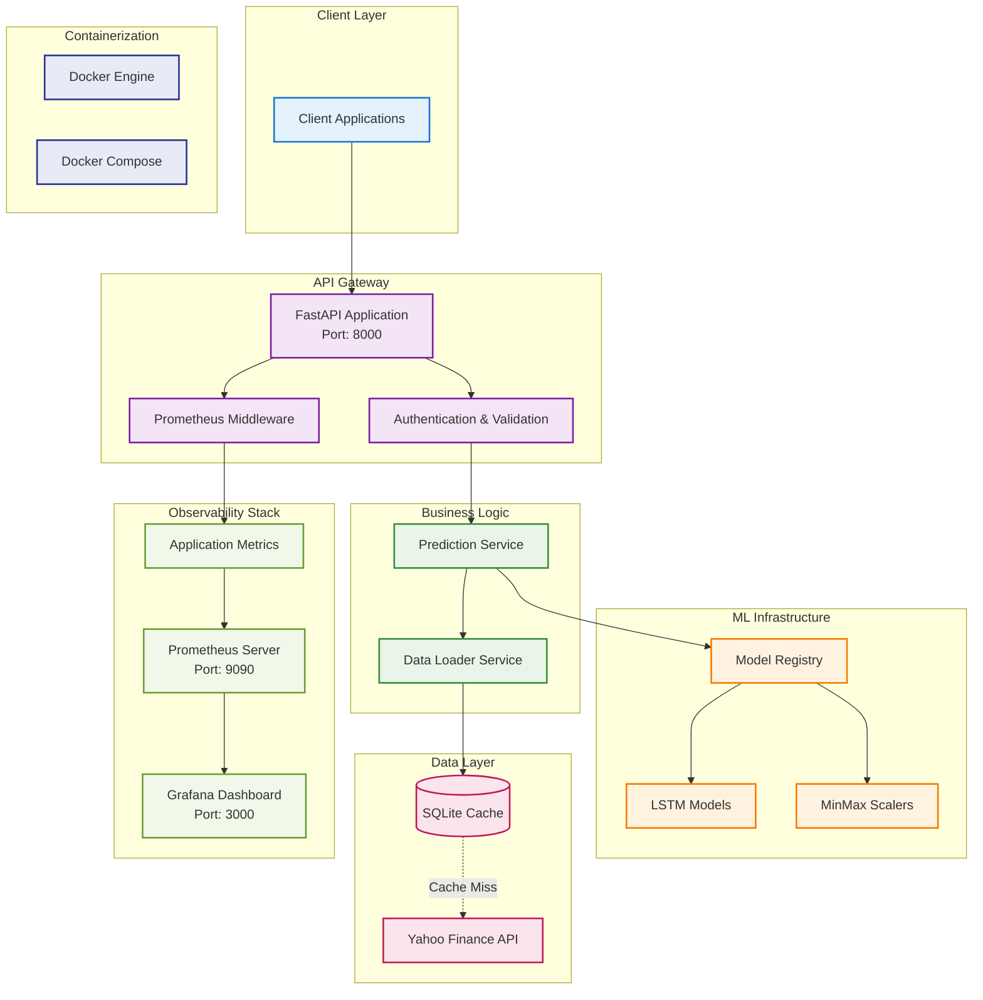
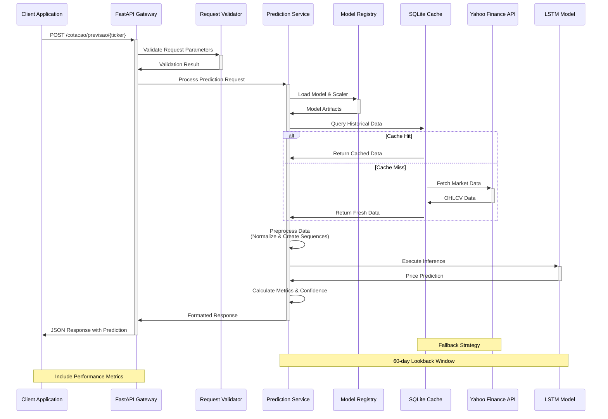
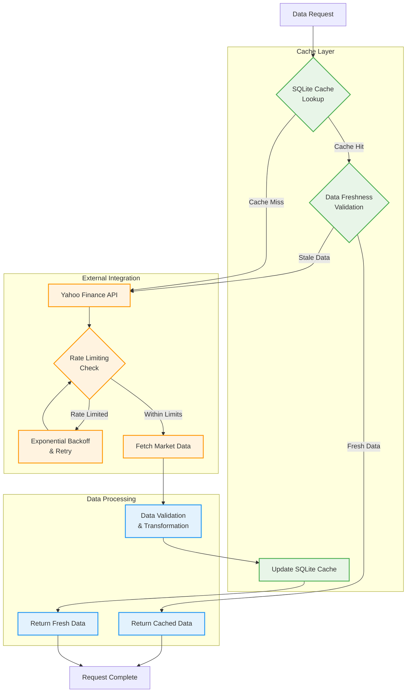
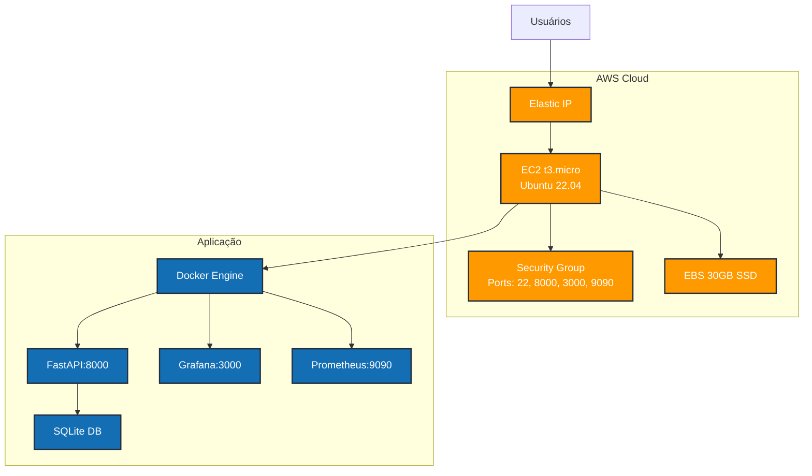
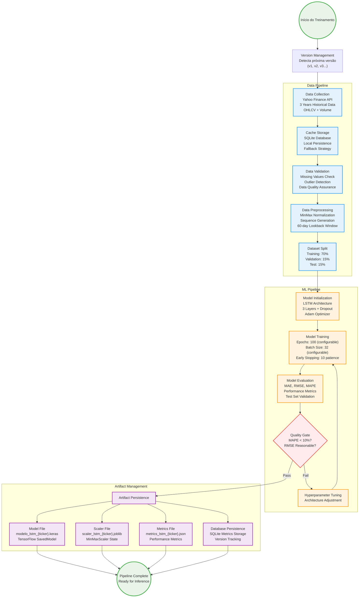

# 🚀 **API de Previsão de Cotações - LSTM**

[](https://python.org)
[](https://fastapi.tiangolo.com)
[](https://tensorflow.org)
[](https://docker.com)
[](https://prometheus.io)
[](https://grafana.com)
[](LICENSE)

---

## 📋 **Índice**

- [Visão Geral e Motivação](#visão-geral-e-motivação)
- [Principais Funcionalidades](#principais-funcionalidades)
- [Demonstração Rápida](#demonstração-rápida)
- [Aplicação Hospedada](#aplicação-hospedada)
- [Vídeo Explicativo](#vídeo-explicativo)
- [Exemplo de Execução do Treinamento](#exemplo-de-execução-do-treinamento)
- [Exemplo de Saída do Treinamento](#exemplo-de-saída-do-treinamento)
- [Exemplo de Request/Response da API](#exemplo-de-requestresponse-da-api)
- [Arquitetura do Projeto](#arquitetura-do-projeto)
- [Instalação e Configuração](#instalação-e-configuração)
- [Execução e Deploy](#execução-e-deploy)
- [Deploy na AWS](#deploy-na-aws)
- [Treinamento dos Modelos](#treinamento-dos-modelos)
- [Documentação da API](#documentação-da-api)
- [Observabilidade e Monitoramento](#observabilidade-e-monitoramento)
- [Limitações e Responsabilidades](#limitações-e-responsabilidades)
- [Estrutura do Projeto](#estrutura-do-projeto)
- [Licença e Contribuição](#licença-e-contribuição

# Visão Geral e Motivação

Sistema avançado de previsão de preços de ações da B3 utilizando redes neurais LSTM (Long Short-Term Memory). A API REST fornece previsões do preço de fechamento para o próximo dia útil, baseada em dados históricos de 3 anos e análise de séries temporais com observabilidade completa.

## 🎯 **Visão Geral**

### **Características Principais**

- 🧠 **Modelos LSTM** individuais por ativo com arquitetura de 3 camadas
- 📊 **Previsões em tempo real** via API REST com FastAPI
- 💾 **Cache inteligente** com SQLite e fallback automático
- � **Métricas de performance** (MAE, RMSE, MAPE) persistidas
- � **Observabilidade completa** com Prometheus + Grafana
- �  **Deploy containerizado** com Docker Compose
- � **Versionamento de modelos** com retreinamento dinâmico
- ⚡ **Middleware de métricas** para monitoramento em tempo real

### **Stack Tecnológica**

| Componente | Tecnologia | Versão | Propósito |
|------------|------------|--------|-----------|
| **API Framework** | FastAPI | Latest | REST API e documentação automática |
| **ML Framework** | TensorFlow/Keras | 2.x | Redes neurais LSTM |
| **Data Processing** | Pandas + NumPy | Latest | Manipulação de dados financeiros |
| **Data Source** | yfinance | 0.2.36 | Yahoo Finance API |
| **Database** | SQLite | Built-in | Cache local e persistência |
| **Monitoring** | Prometheus | Latest | Coleta de métricas |
| **Visualization** | Grafana | Latest | Dashboards e alertas |
| **Containerization** | Docker + Compose | Latest | Orquestração de serviços |
| **Preprocessing** | scikit-learn | Latest | Normalização e métricas |

# Principais Funcionalidades

## **Funcionalidades Core**

### 🔮 **Previsão de Preços**

- Prediz o **preço de fechamento** do próximo dia útil
- Utiliza **60 dias** de histórico como entrada (look-back window)
- Normalização automática com **MinMaxScaler**

### 📊 **Análise Histórica**

- Previsões retrospectivas dos últimos N dias úteis
- Comparação entre **preço real vs predito**
- Validação da performance do modelo

### 📈 **Métricas de Avaliação**

- **MAE** (Mean Absolute Error)
- **RMSE** (Root Mean Square Error)
- **MAPE** (Mean Absolute Percentage Error)

## **Ativos Suportados**

| Ticker | Empresa | Setor | Status |
|--------|---------|-------|--------|
| **VALE3.SA** | Vale S.A. | Mineração | ✅ Ativo |
| **PETR4.SA** | Petrobras PN | Petróleo e Gás | ✅ Ativo |
| **ITSA4.SA** | Itaúsa PN | Holding Financeira | ✅ Ativo |
| **MGLU3.SA** | Magazine Luiza ON | Varejo | ✅ Ativo |
| **TAEE11.SA** | Taesa UNT | Energia Elétrica | ✅ Ativo |

> **Nota**: Todos os modelos são treinados individualmente com dados históricos de 3 anos e janela de lookback de 60 dias.

# Demonstração Rápida

## **Aplicação Hospedada**
>
> - **Aplicação:** http://56.125.194.131:8000/docs
> - **Grafana:** http://56.125.194.131:3000/

## **Vídeo Explicativo**

**🎬 Assista ao vídeo completo:** [API de Previsão de Cotações com LSTM - Demonstração Completa](https://youtu.be/qwVbdNO-BjU?si=h6QF_cmVnHEgJpJX)

## **Exemplo de Execução do Treinamento**

```bash
# Treinamento com parâmetros padrão
python src/app/train_lstm.py

# Saída esperada:
🤖 Iniciando processo de treinamento de modelos LSTM...
📁 Nova versão detectada: v2. Salvando em: /path/to/v2

--- Processando ticker: VALE3.SA (Epochs: 100, Batch: 32) ---
Dados carregados: 782 registros
Sequências criadas: 722 amostras
Modelo LSTM construído.
Treinamento iniciado...
Epoch 45/100 - Loss: 0.0023 - Val_Loss: 0.0031
Early stopping triggered
Métricas VALE3.SA: MAE=1.23
Artefatos e métricas da v2 salvos para VALE3.SA.
✅ Pipeline completo para VALE3.SA em /path/to/v2

--- Processando ticker: PETR4.SA (Epochs: 100, Batch: 32) ---
[... processo similar para outros tickers ...]
```

## **Exemplo de Saída do Treinamento**

```
--- Processando ticker: VALE3.SA ---
Dados carregados: 782 registros
Sequências criadas: 722 amostras
Treinamento iniciado...
Epoch 45/100 - Loss: 0.0023 - Val_Loss: 0.0031
Early stopping triggered
Métricas finais:
├── MAE: 1.23
├── RMSE: 1.67
└── MAPE: 2.45%
✅ Pipeline completo para VALE3.SA executado com sucesso!
```

## **Exemplo de Request/Response da API**

### **Request**

```bash
curl -X GET "http://localhost:8000/cotacao/previsao/VALE3?versao=v1" \
     -H "accept: application/json"
```

### **Response**

```json
{
  "symbol": "VALE3.SA",
  "name": "VALE3",
  "predicted_price": 61.47,
  "prediction_date": "2024-12-26",
  "MAE": 1.23,
  "RMSE": 1.67,
  "MAPE": 2.45
}
```

# Arquitetura do Projeto

## 🏗️ **Arquitetura Técnica**

### **Visão Geral da Arquitetura**



### **Componentes Principais**

#### **1. FastAPI Application** (`src/app/main.py`)

- **Framework**: FastAPI com Uvicorn
- **Middleware**: Prometheus metrics collection
- **Documentação**: Swagger UI automático
- **CORS**: Configurado para desenvolvimento

#### **2. Prediction Service** (`src/app/services/`)

- **Responsabilidade**: Orquestração de previsões
- **Carregamento**: Modelos e scalers do disco
- **Formatação**: Tickers para padrão Yahoo Finance (.SA)
- **Validação**: Dados de entrada e saída

#### **3. Data Layer** (`src/app/data/`)

- **DataLoader**: Download e cache de dados
- **SQLite**: Cache local com fallback automático
- **Yahoo Finance**: Fonte primária de dados
- **Período**: 3 anos de histórico (configurável)

#### **4. LSTM Models** (`src/app/models/`)

- **RegressaoLSTM**: Classe principal do modelo
- **Arquitetura**: 3 camadas LSTM + Dropout
- **Persistência**: Keras (.keras) + Joblib (.jobjob)
- **Métricas**: Cálculo automático de MAE, RMSE, MAPE

### **Fluxo de Dados**



### **Estratégia de Cache**



# Instalação e Configuração

## **Pré-requisitos**

| Requisito | Versão Mínima | Recomendado | Observações |
|-----------|---------------|-------------|-------------|
| **Python** | 3.11+ | 3.11+ | Compatibilidade com TensorFlow |
| **RAM** | 4GB | 8GB+ | Para treinamento de modelos |
| **Armazenamento** | 2GB | 5GB+ | Modelos + dados históricos |
| **Docker** | 20.10+ | Latest | Para deploy containerizado |
| **Docker Compose** | 2.0+ | Latest | Orquestração de serviços |

## **Instalação Local (Desenvolvimento)**

```bash
# 1. Clone o repositório
git clone <repository-url>
cd tech4

# 2. Crie um ambiente virtual (recomendado)
python -m venv venv
source venv/bin/activate  # Linux/Mac
# ou
venv\Scripts\activate     # Windows

# 3. Instale as dependências
pip install -r requirements.txt

# 4. Crie a estrutura de diretórios
mkdir -p src/app/modelos_treinados_lstm/v1
mkdir -p src/app/dados

# 5. Execute o treinamento inicial (obrigatório)
python src/app/train_lstm.py

# 6. Inicie a API
python src/app/main.py
```

## **Instalação com Docker (Produção)**

```bash
# 1. Clone o repositório
git clone <repository-url>
cd tech4

# 2. Build e execução completa
docker-compose up -d --build

# 3. Verificar status dos serviços
docker-compose ps

# 4. Logs em tempo real
docker-compose logs -f api
```

## **Verificação da Instalação**

```bash
# Health check da API
curl http://localhost:8000/docs

# Teste de previsão
curl http://localhost:8000/cotacao/previsao/VALE3

# Métricas Prometheus
curl http://localhost:8000/metrics

# Dashboard Grafana
# Acesse: http://localhost:3000 (admin/admin)
```

## **Configurações de Ambiente**

#### **Variáveis de Ambiente**

```bash
# .env file
HOST=0.0.0.0
PORT=8000
LOG_LEVEL=INFO
YAHOO_FINANCE_TIMEOUT=30
MODEL_CACHE_TTL=3600
PROMETHEUS_ENABLED=true
GRAFANA_ADMIN_PASSWORD=secure_password
```

#### **Docker Compose Override**

```yaml
# docker-compose.override.yml
version: "3.9"
services:
  api:
    environment:
      - LOG_LEVEL=DEBUG
      - YAHOO_FINANCE_TIMEOUT=60
    volumes:
      - ./logs:/app/logs
  
  grafana:
    environment:
      - GF_SECURITY_ADMIN_PASSWORD=${GRAFANA_PASSWORD}
    ports:
      - "3001:3000"  # Porta alternativa
```

# Execução e Deploy

## **Execução Local (Desenvolvimento)**

```bash
# Método 1: Usando o script principal
python src/app/main.py

# Método 2: Usando uvicorn diretamente
uvicorn src.app.main:app --host 0.0.0.0 --port 8000 --reload

# Método 3: Com configurações customizadas
HOST=0.0.0.0 PORT=8080 python src/app/main.py
```

## **Execução com Docker**

#### **Opção 1: Stack Completa (Recomendado)**
```bash
# Inicia todos os serviços (API + Prometheus + Grafana)
docker-compose up -d

# Verifica status dos containers
docker-compose ps

# Logs em tempo real
docker-compose logs -f

# Para serviços específicos
docker-compose logs -f api
docker-compose logs -f grafana
docker-compose logs -f prometheus
```

#### **Opção 2: Apenas API**
```bash
# Build da imagem
docker build -t fastapi-stock-api .

# Execução simples
docker run -p 8000:8000 fastapi-stock-api

# Execução com volumes (persistência)
docker run -p 8000:8000 \
  -v $(pwd)/src/app/dados:/app/src/app/dados \
  -v $(pwd)/src/app/modelos_treinados_lstm:/app/src/app/modelos_treinados_lstm \
  fastapi-stock-api
```

## **Health Checks e Monitoramento**

```bash
# Health check da API
curl -f http://localhost:8000/docs || exit 1

# Verificação de métricas
curl -s http://localhost:8000/metrics | grep http_requests_total

# Status dos modelos
curl http://localhost:8000/cotacao/previsao/VALE3 | jq '.MAE'

# Logs estruturados
docker-compose logs api | grep ERROR

# Monitoramento de recursos
docker stats fastapi-stock-api
```

## **Troubleshooting**

#### **Problemas Comuns**

| Problema | Sintoma | Solução |
|----------|---------|---------|
| **Modelo não encontrado** | HTTP 500 | Execute `python src/app/train_lstm.py` |
| **Dados desatualizados** | Previsões antigas | Verifique conexão com Yahoo Finance |
| **Alta latência** | Timeout nas requests | Otimize cache ou aumente recursos |
| **Grafana não carrega** | Dashboard vazio | Verifique configuração do Prometheus |

#### **Comandos de Debug**

```bash
# Verificar logs detalhados
docker-compose logs -f --tail=100 api

# Entrar no container para debug
docker-compose exec api bash

# Verificar modelos treinados
ls -la src/app/modelos_treinados_lstm/v*/

# Testar conexão com Yahoo Finance
python -c "import yfinance as yf; print(yf.download('VALE3.SA', period='1d'))"

# Verificar métricas do Prometheus
curl -s http://localhost:9090/api/v1/query?query=up
```

# Deploy na AWS

A aplicação foi hospedada na **AWS Free Tier** utilizando uma instância **EC2 t3.micro** com **Ubuntu 22.04 LTS**, demonstrando como deployar um sistema de ML em produção com recursos limitados.

## **Infraestrutura Utilizada**

| Componente | Especificação           | Observações |
|------------|-------------------------|-------------|
| **Instância** | EC2 t3.micro            | 1 vCPU, 1GB RAM, Free Tier elegível |
| **Sistema Operacional** | Ubuntu 22.04 LTS        | AMI oficial da Canonical |
| **Armazenamento** | 30GB gp3 SSD            | Volume EBS |
| **Rede** | VPC padrão + Elastic IP | IP público fixo |
| **Containerização** | Docker + Docker Compose | Orquestração de serviços |

## **Arquitetura de Deploy**



## **Otimizações para t3.micro**
- **Swap de 7GB** configurado para compensar limitação de RAM
- **Restart automático** dos containers em caso de falha
- **Health checks** configurados para monitoramento

## **Endpoints Disponíveis**

```
📊 API Principal:        http://elastic-ip:8000
📚 Documentação:         http://elastic-ip:8000/docs
📈 Dashboard Grafana:    http://elastic-ip:3000
🔍 Métricas Prometheus:  http://elastic-ip:9090
```

## **Custos (Free Tier)**

| Recurso | Custo Mensal |
|---------|--------------|
| **EC2 t3.micro** | $0 (750h grátis) |
| **EBS 8GB** | $0 (30GB grátis) |
| **Elastic IP** | $0 |
| **Data Transfer** | $0 (15GB grátis) |
| **Total** | **$0/mês** |

# Treinamento dos Modelos

## **Processo de Treinamento**

```bash
# Executa o pipeline completo de treinamento
python src/app/train_lstm.py
```

## **Pipeline de Treinamento**



## **Arquitetura da Rede Neural LSTM**

**Arquitetura LSTM utilizada:**

- **Input Layer:** Sequência de preços normalizados (shape: batch_size, 60, 1)
- **LSTM Layer 1:** 50 unidades, retorna sequências, ativação tanh
- **Dropout Layer 1:** taxa 0.2
- **LSTM Layer 2:** 50 unidades, não retorna sequências, ativação tanh
- **Dropout Layer 2:** taxa 0.2
- **Dense Layer 1:** 25 unidades, ativação ReLU
- **Dense Layer 2:** 1 unidade, ativação linear (regressão)
- **Denormalização:** MinMaxScaler.inverse_transform
- **Saída:** Preço previsto do próximo dia útil (R$)


## **Configurações de Treinamento**

| Parâmetro | Valor Padrão | Configurável | Descrição |
|-----------|--------------|--------------|-----------|
| **Epochs** | 100 | ✅ Via API | Número máximo de épocas |
| **Batch Size** | 32 | ✅ Via API | Tamanho do lote de treinamento |
| **Learning Rate** | 0.001 | ❌ Fixo | Taxa de aprendizado do Adam |
| **Early Stopping** | 10 epochs | ❌ Fixo | Paciência para parada antecipada |
| **Validation Split** | 15% | ❌ Fixo | Porcentagem para validação |
| **Test Split** | 15% | ❌ Fixo | Porcentagem para teste |
| **Lookback Window** | 60 dias | ❌ Fixo | Janela de dados históricos |
| **Dropout Rate** | 0.2 | ❌ Fixo | Taxa de dropout para regularização |

## **Versionamento de Modelos**

O sistema implementa versionamento automático de modelos:

```bash
src/app/modelos_treinados_lstm/
├── v1/                          # Primeira versão
│   ├── modelo_lstm_VALE3.SA.keras
│   ├── scaler_lstm_VALE3.SA.joblib
│   └── metrics_lstm_VALE3.SA.json
├── v2/                          # Segunda versão (após retreinamento)
│   ├── modelo_lstm_VALE3.SA.keras
│   ├── scaler_lstm_VALE3.SA.joblib
│   └── metrics_lstm_VALE3.SA.json
└── v3/                          # Terceira versão
    └── ...
```

## **Retreinamento via API**

```bash
# Retreinamento com parâmetros customizados
curl -X POST "http://localhost:8000/cotacao/retreinar?epochs=50&batch=16"

# Resposta:
{
  "status": "Treinamento iniciado em segundo plano"
}

# Monitoramento via logs
docker-compose logs -f api | grep "Pipeline completo"
```

# Documentação da API

## **Base URL**: `http://localhost:8000`

### **📊 Documentação Interativa**

- **Swagger UI**: `http://localhost:8000/docs` - Interface interativa completa
- **ReDoc**: `http://localhost:8000/redoc` - Documentação alternativa
- **OpenAPI Schema**: `http://localhost:8000/openapi.json` - Schema JSON

---

### **1. Previsão Individual**

Obtém a previsão do preço de fechamento para o próximo dia útil.

```http
GET /cotacao/previsao/{acao}?versao={versao}
```

**Parâmetros:**
- `acao` (path, obrigatório): Código da ação (`VALE3`, `PETR4`, `ITSA4`, `MGLU3`, `TAEE11`)
- `versao` (query, opcional): Versão do modelo (`v1`, `v2`, etc.) - padrão: `v1`

**Exemplo de Request:**

```bash
curl -X GET "http://localhost:8000/cotacao/previsao/VALE3?versao=v1" \
     -H "accept: application/json"
```

**Exemplo de Response:**

```json
{
  "symbol": "VALE3.SA",
  "name": "VALE3",
  "predicted_price": 61.47,
  "prediction_date": "2024-12-26",
  "MAE": 1.23,
  "RMSE": 1.67,
  "MAPE": 2.45
}
```

---

### **2. Previsão Histórica**

Obtém previsões retrospectivas para análise de performance.

```http
GET /cotacao/historico/{acao}?versao={versao}
```

**Parâmetros:**
- `acao` (path, obrigatório): Código da ação
- `versao` (query, opcional): Versão do modelo - padrão: `v1`

**Exemplo de Request:**

```bash
curl -X GET "http://localhost:8000/cotacao/historico/VALE3?versao=v1" \
     -H "accept: application/json"
```

**Exemplo de Response:**

```json
[
  {
    "symbol": "VALE3.SA",
    "name": "VALE3",
    "predicted_price": 61.20,
    "prediction_date": "2024-12-25",
    "MAE": 1.23,
    "RMSE": 1.67,
    "MAPE": 2.45
  },
  {
    "symbol": "VALE3.SA",
    "name": "VALE3",
    "predicted_price": 60.98,
    "prediction_date": "2024-12-24",
    "MAE": 1.23,
    "RMSE": 1.67,
    "MAPE": 2.45
  }
]
```

---

### **3. Retreinamento de Modelos**

Inicia o retreinamento de todos os modelos em background.

```http
POST /cotacao/retreinar?epochs={epochs}&batch={batch_size}
```

**Parâmetros:**
- `epochs` (query, opcional): Número de épocas - padrão: `100`
- `batch` (query, opcional): Tamanho do batch - padrão: `32`

**Exemplo de Request:**

```bash
curl -X POST "http://localhost:8000/cotacao/retreinar?epochs=50&batch=16" \
     -H "accept: application/json"
```

**Exemplo de Response:**

```json
{
  "status": "Treinamento iniciado em segundo plano"
}
```

---

### **4. Métricas Prometheus**

Endpoint para coleta de métricas pelo Prometheus.

```http
GET /metrics
```

**Exemplo de Response:**

```
# HELP http_requests_total Total de requisições HTTP
# TYPE http_requests_total counter
http_requests_total{method="GET",endpoint="/cotacao/previsao/VALE3",status="200"} 42.0

# HELP http_request_duration_seconds Latência das requisições HTTP
# TYPE http_request_duration_seconds histogram
http_request_duration_seconds_bucket{endpoint="/cotacao/previsao/VALE3",le="0.1"} 35.0
http_request_duration_seconds_bucket{endpoint="/cotacao/previsao/VALE3",le="0.25"} 40.0
http_request_duration_seconds_bucket{endpoint="/cotacao/previsao/VALE3",le="0.5"} 42.0
http_request_duration_seconds_bucket{endpoint="/cotacao/previsao/VALE3",le="+Inf"} 42.0
http_request_duration_seconds_sum{endpoint="/cotacao/previsao/VALE3"} 8.2
http_request_duration_seconds_count{endpoint="/cotacao/previsao/VALE3"} 42.0
```

---

### **Códigos de Status HTTP**

| Código | Descrição | Exemplo |
|--------|-----------|---------|
| `200` | Sucesso | Previsão retornada com sucesso |
| `404` | Não encontrado | Ativo não suportado ou versão inexistente |
| `422` | Parâmetros inválidos | Ticker inválido ou parâmetros malformados |
| `500` | Erro interno | Modelo não encontrado, dados insuficientes |

### **Tratamento de Erros**

```json
{
  "detail": "Pasta 'v99' não encontrada no servidor."
}
```

# Observabilidade e Monitoramento

## **Stack de Monitoramento**

| Componente | Porta | Usuário | Senha | Propósito |
|------------|-------|---------|-------|-----------|
| **Grafana** | 3000 | `admin` | `admin` | Dashboards e visualização |
| **Prometheus** | 9090 | - | - | Coleta e armazenamento de métricas |
| **FastAPI Metrics** | 8000/metrics | - | - | Endpoint de métricas da aplicação |

## **Métricas Coletadas**

#### **Métricas HTTP (Prometheus)**

```python
# Contador de requisições por endpoint
http_requests_total{method, endpoint, status}

# Histograma de latência por endpoint
http_request_duration_seconds{endpoint}

# Exemplos de queries PromQL
rate(http_requests_total[5m])                    # Taxa de requisições por segundo
histogram_quantile(0.95, http_request_duration_seconds_bucket)  # Latência P95
```

#### **Métricas de Negócio**

```python
# Métricas específicas da aplicação (implementação futura)
model_prediction_accuracy{ticker, version}       # Acurácia por modelo
model_inference_duration{ticker}                 # Tempo de inferência
cache_hit_ratio{data_source}                    # Taxa de acerto do cache
yahoo_finance_api_calls_total{status}           # Chamadas para API externa
```

## **Configuração do Prometheus**

```yaml
# prometheus/prometheus.yml
global:
  scrape_interval: 15s
  evaluation_interval: 15s

rule_files:
  # - "first_rules.yml"
  # - "second_rules.yml"

scrape_configs:
  - job_name: 'fastapi-stock-api'
    static_configs:
      - targets: ['api:8000']
    scrape_interval: 5s
    metrics_path: '/metrics'
    scrape_timeout: 10s
```

## **Dashboards Grafana**

#### **Dashboard Principal - API Performance**

```json
{
  "dashboard": {
    "title": "FastAPI Stock Prediction API",
    "panels": [
      {
        "title": "Request Rate",
        "type": "graph",
        "targets": [
          {
            "expr": "rate(http_requests_total[5m])",
            "legendFormat": "{{method}} {{endpoint}}"
          }
        ]
      },
      {
        "title": "Response Time P95",
        "type": "graph", 
        "targets": [
          {
            "expr": "histogram_quantile(0.95, rate(http_request_duration_seconds_bucket[5m]))",
            "legendFormat": "P95 Latency"
          }
        ]
      },
      {
        "title": "Error Rate",
        "type": "graph",
        "targets": [
          {
            "expr": "rate(http_requests_total{status=~\"4..|5..\"}[5m])",
            "legendFormat": "{{status}} errors"
          }
        ]
      }
    ]
  }
}
```

#### **Dashboard de Modelos ML**

- **Acurácia por Ticker**: Comparação de MAE, RMSE, MAPE
- **Tempo de Inferência**: Latência por modelo
- **Uso de Cache**: Hit/miss ratio por fonte de dados
- **Qualidade dos Dados**: Freshness e completude


## **Logs Estruturados**

#### **Configuração de Logging**

```python
# src/app/logger/logger.py
import logging
import json
from datetime import datetime

class StructuredLogger:
    def __init__(self, name: str):
        self.logger = logging.getLogger(name)
        self.logger.setLevel(logging.INFO)
        
        handler = logging.StreamHandler()
        formatter = logging.Formatter(
            '%(asctime)s - %(name)s - %(levelname)s - %(message)s'
        )
        handler.setFormatter(formatter)
        self.logger.addHandler(handler)
    
    def log_prediction(self, ticker: str, price: float, latency: float):
        self.logger.info(json.dumps({
            "event": "prediction_made",
            "ticker": ticker,
            "predicted_price": price,
            "latency_ms": latency * 1000,
            "timestamp": datetime.utcnow().isoformat()
        }))
    
    def log_error(self, error: str, context: dict = None):
        self.logger.error(json.dumps({
            "event": "error_occurred",
            "error": error,
            "context": context or {},
            "timestamp": datetime.utcnow().isoformat()
        }))
```

#### **Exemplos de Logs**

```json
// Previsão bem-sucedida
{
  "event": "prediction_made",
  "ticker": "VALE3.SA",
  "predicted_price": 61.47,
  "latency_ms": 245.3,
  "timestamp": "2024-12-26T10:30:00Z"
}

// Erro de modelo
{
  "event": "error_occurred", 
  "error": "Model not found for ticker INVALID.SA",
  "context": {
    "ticker": "INVALID.SA",
    "version": "v1",
    "endpoint": "/cotacao/previsao/INVALID"
  },
  "timestamp": "2024-12-26T10:31:00Z"
}

// Cache miss
{
  "event": "cache_miss",
  "ticker": "PETR4.SA",
  "data_source": "yahoo_finance",
  "fetch_duration_ms": 1250.7,
  "timestamp": "2024-12-26T10:32:00Z"
}
```

#### **Comandos de Monitoramento**

```bash
# Verificar métricas em tempo real
watch -n 5 'curl -s http://localhost:8000/metrics | grep http_requests_total'

# Monitorar logs de erro
docker-compose logs -f api | grep ERROR

# Verificar status dos containers
docker-compose ps

# Monitorar recursos do sistema
docker stats --format "table {{.Container}}\t{{.CPUPerc}}\t{{.MemUsage}}\t{{.NetIO}}"

# Testar conectividade com Prometheus
curl -s http://localhost:9090/api/v1/query?query=up | jq '.data.result'

# Verificar dashboards do Grafana
curl -s -u admin:admin http://localhost:3000/api/dashboards/home
```

# Limitações e Responsabilidades

## **Limitações Técnicas**

#### **📊 Dados e Modelos**

| Limitação | Descrição | Impacto | Mitigação Possível |
|-----------|-----------|---------|-------------------|
| **Período Histórico** | Limitado a 3 anos de dados | Pode não capturar ciclos longos | Expandir para 5-10 anos |
| **Frequência de Dados** | Apenas dados diários (EOD) | Não captura movimentos intraday | Implementar dados de alta frequência |
| **Universo de Ativos** | Restrito a 5 ações da B3 | Cobertura limitada do mercado | Expandir para mais setores |
| **Fonte Única** | Dependência do Yahoo Finance | Ponto único de falha | Implementar múltiplas fontes |
| **Features Limitadas** | Apenas preços históricos | Ignora fundamentalistas e sentimento | Adicionar indicadores técnicos e fundamentalistas |

#### **🧠 Machine Learning**

| Limitação | Descrição | Impacto | Solução Recomendada |
|-----------|-----------|---------|-------------------|
| **Arquitetura Simples** | LSTM básico sem ensemble | Menor robustez | Implementar ensemble de modelos |
| **Sem Retreinamento Automático** | Modelos ficam desatualizados | Degradação da performance | Pipeline de retreinamento automático |
| **Validação Simples** | Sem walk-forward analysis | Overfitting temporal | Implementar validação temporal |
| **Sem Análise de Regime** | Não detecta mudanças de mercado | Performance inconsistente | Detectores de mudança de regime |
| **Sem Incerteza** | Não fornece intervalos de confiança | Decisões sem contexto de risco | Implementar Bayesian LSTM |

#### **⚡ Performance e Escalabilidade**

| Aspecto | Limitação Atual | Impacto | Solução |
|---------|----------------|---------|---------|
| **Latência** | 200-500ms por previsão | UX degradada | Cache de previsões, otimização de modelo |
| **Concorrência** | Single-threaded | Não suporta alta carga | Load balancing, async processing |
| **Cache** | Sem TTL automático | Dados podem ficar stale | Implementar cache inteligente |
| **Escalabilidade** | Single-instance | Limitação de throughput | Arquitetura distribuída |
| **Memória** | Carregamento de todos os modelos | Alto uso de RAM | Lazy loading, model serving |

## **Limitações Financeiras e Regulatórias**

#### **❌ O que este sistema NÃO é:**

```
🚫 AVISOS IMPORTANTES

❌ NÃO é consultoria financeira registrada na CVM
❌ NÃO substitui análise profissional qualificada  
❌ NÃO garante lucros ou performance futura
❌ NÃO considera análise fundamentalista
❌ NÃO é um sistema de trading automatizado
❌ NÃO considera fatores macroeconômicos
❌ NÃO analisa notícias ou eventos corporativos
❌ NÃO considera liquidez ou volume de negociação
```

#### **✅ O que este sistema É:**

```
✅ PROPÓSITOS VÁLIDOS

✅ Ferramenta educacional para aprender ML em finanças
✅ Prova de conceito técnica de LSTM em séries temporais
✅ Sistema de apoio à decisão (não decisão final)
✅ Código aberto auditável e modificável
✅ Plataforma para experimentação e pesquisa
✅ Base para desenvolvimento de sistemas mais robustos
✅ Demonstração de arquitetura de ML em produção
```

## **🛡️ Uso Responsável e Ético**

#### **Diretrizes de Uso**

```
🎯 DIRETRIZES OBRIGATÓRIAS

ANTES de qualquer decisão de investimento:
├── 📚 Estude os fundamentos da empresa (balanços, DRE, fluxo de caixa)
├── 📊 Analise o contexto macroeconômico e setorial
├── 💰 Defina seu perfil de risco e objetivos
├── 🎯 Diversifique adequadamente seus investimentos  
├── 👨‍💼 Consulte profissionais qualificados (analistas, assessores)
├── 📈 Use múltiplas fontes de análise
└── 🧠 Desenvolva seu próprio conhecimento financeiro

⚠️  NUNCA invista mais do que pode perder
⚠️  SEMPRE faça sua própria análise independente
⚠️  Este sistema pode estar COMPLETAMENTE ERRADO
⚠️  Performance passada NÃO garante resultados futuras
⚠️  Mercados são imprevisíveis por natureza
```

#### **Responsabilidades do Usuário**

| Responsabilidade | Descrição | Importância |
|------------------|-----------|-------------|
| **Due Diligence** | Pesquisar independentemente cada investimento | 🔴 Crítica |
| **Gestão de Risco** | Definir stop-loss e position sizing | 🔴 Crítica |
| **Diversificação** | Não concentrar em poucos ativos | 🟡 Alta |
| **Educação Contínua** | Estudar mercados e investimentos | 🟡 Alta |
| **Compliance** | Seguir regulamentações aplicáveis | 🔴 Crítica |


## **Disclaimer Legal**

```
📋 ISENÇÃO DE RESPONSABILIDADE

Este software é fornecido "como está", sem garantias de qualquer tipo.
Os desenvolvedores não se responsabilizam por:

• Perdas financeiras decorrentes do uso das previsões
• Decisões de investimento baseadas nas informações fornecidas  
• Falhas técnicas ou indisponibilidade do sistema
• Precisão ou atualidade dos dados e previsões
• Conformidade com regulamentações específicas

O uso deste sistema implica na aceitação integral destes termos.
```

# Estrutura do Projeto

```
tech4/
├── 📄 docker-compose.yml          # Orquestração de containers
├── 📄 Dockerfile                  # Build da API
├── 📄 requirements.txt            # Dependências Python
├── 📄 README.md                   # Este arquivo
│
├── 📁 src/app/                    # Código fonte principal
│   ├── 📄 main.py                 # FastAPI application
│   ├── 📄 train_lstm.py           # Pipeline de treinamento
│   │
│   ├── 📁 api/controller/         # Controllers REST
│   │   └── 📄 stocks.py           # Endpoints de ações
│   │
│   ├── 📁 config/                 # Configurações
│   │   └── 📄 params.py           # Parâmetros globais
│   │
│   ├── 📁 data/                   # Camada de dados
│   │   ├── 📄 data_loader.py      # Download e cache
│   │   └── 📄 metrics_db.py       # Métricas do banco
│   │
│   ├── 📁 dados/                  # Cache local
│   │   └── 📄 dados_mercado.db    # SQLite database
│   │
│   ├── 📁 logger/                 # Sistema de logs
│   │   └── 📄 logger.py           # Configuração de logging
│   │
│   ├── 📁 models/                 # Modelos ML
│   │   └── 📄 regression_lstm.py  # Classe LSTM
│   │
│   ├── 📁 modelos_treinados_lstm/ # Artefatos ML
│   │   ├── 📄 modelo_lstm_*.keras # Modelos treinados
│   │   ├── 📄 scaler_lstm_*.joblib# Scalers
│   │   └── 📄 metrics_lstm_*.json # Métricas
│   │
│   ├── 📁 schemas/                # Modelos Pydantic
│   │   └── 📄 prediction.py       # Schema de resposta
│   │
│   └── 📁 services/               # Lógica de negócio
│       └── 📄 prediction_service.py # Serviço de previsão
│
├── 📁 grafana/                    # Configuração Grafana
│   ├── 📁 dashboards/             # Dashboards JSON
│   └── 📁 provisioning/           # Configuração automática
│
└── 📁 prometheus/                 # Configuração Prometheus
    └── 📄 prometheus.yml          # Configuração de scraping
```
